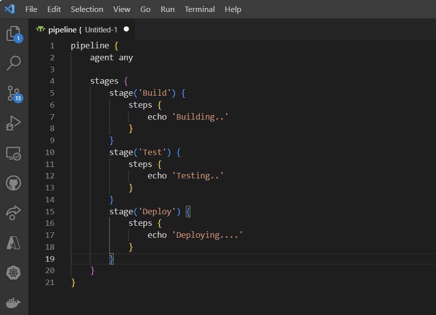
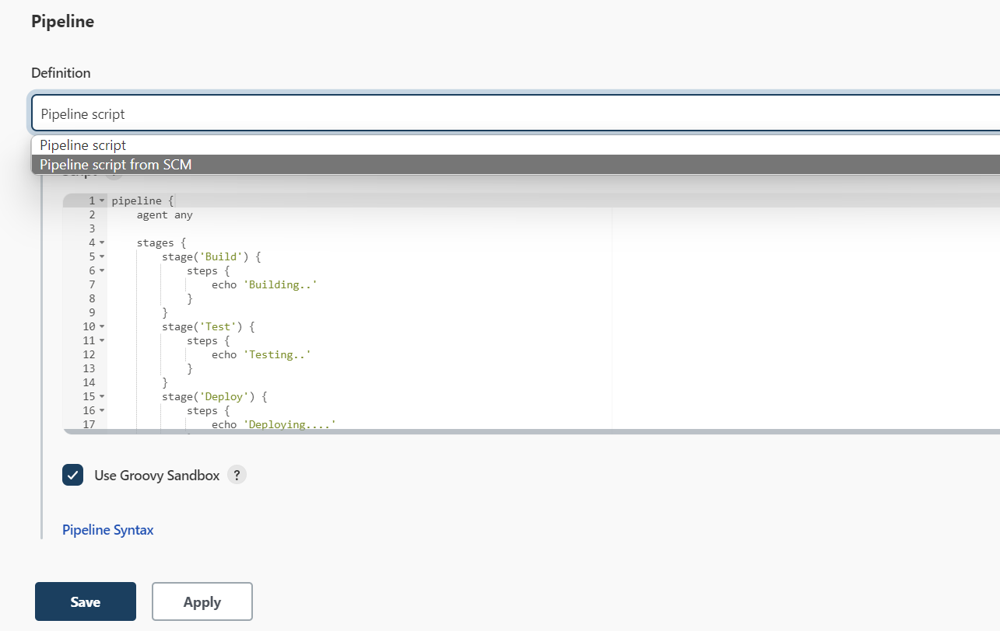
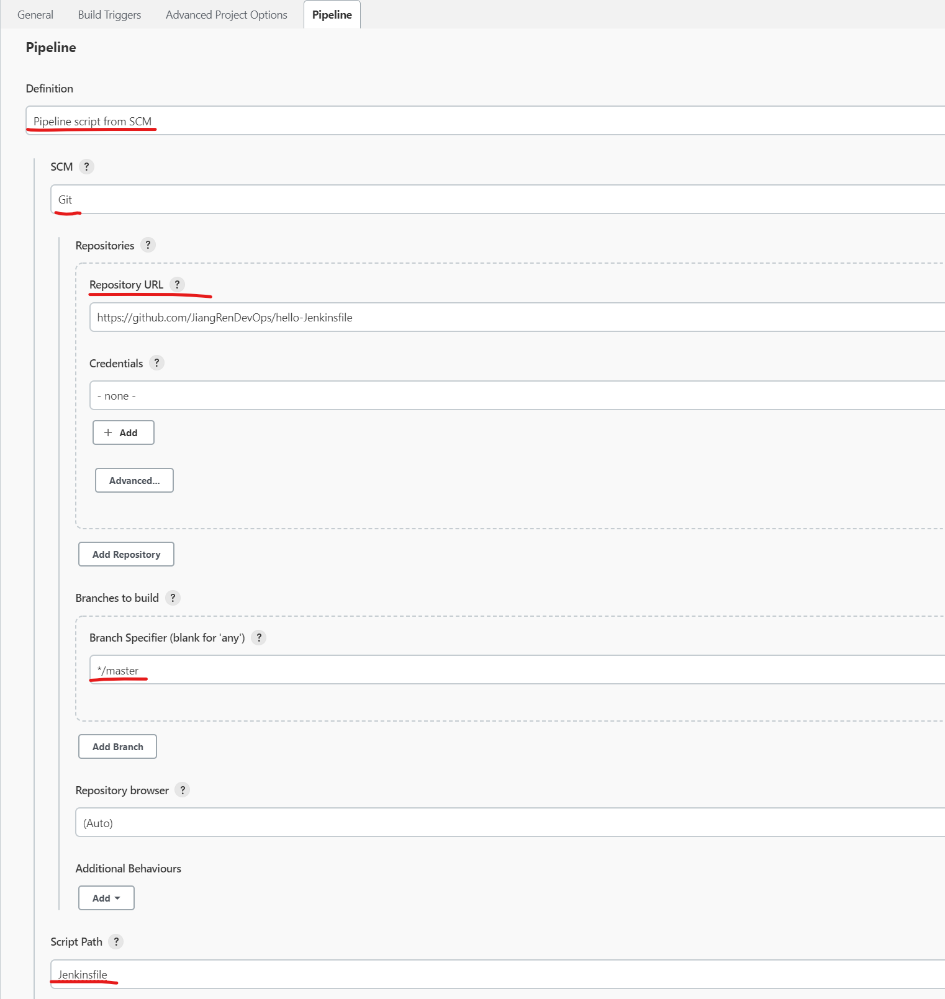

# Getting started with Jenkinsfile

A `Jenkinsfile` is a text file that contains the definition of a Jenkins Pipeline and is checked into source control. Consider the following Pipeline which implements a basic three-stage continuous delivery pipeline.

```jenkinsfile
pipeline {
    agent any

    stages {
        stage('Build') {
            steps {
                echo 'Building..'
            }
        }
        stage('Test') {
            steps {
                echo 'Testing..'
            }
        }
        stage('Deploy') {
            steps {
                echo 'Deploying....'
            }
        }
    }
}
```

Not all Pipelines will have these same three stages, but it is a good starting point to define them for most projects.

Using a text editor, ideally one which supports Groovy syntax highlighting, create a new `Jenkinsfile` in the root directory of the project.



## Create your frist pipeline

A Pipeline can be created in one of the following ways:

- Through Blue Ocean - after setting up a Pipeline project in Blue Ocean, the Blue Ocean UI helps you write your Pipeline’s `Jenkinsfile` and commit it to source control.

- Through the classic UI - you can enter a basic Pipeline directly in Jenkins through the classic UI.

- In SCM - you can write a `Jenkinsfile` manually, which you can commit to your project’s source control repository.

Here is our first Pipeline created through the Jenkins classic UI:



Complex Pipelines are difficult to write and maintain within the classic UI’s Script text area of the Pipeline configuration page.

To make this easier, your Pipeline’s `Jenkinsfile` can be written in a text editor or integrated development environment (IDE) and committed to source control. This is usually done by developers. Jenkins can then check out your Jenkinsfile from source control as part of your Pipeline project’s build process and then proceed to execute your Pipeline.



When you update the designated repository, a new build is triggered, as long as the Pipeline is configured with an SCM polling trigger.

## How to workout my Jenkinsfile?

Read documents is an essential skill to DevOps Engineer. Please read this doc to learn more about `Jenkinsfile`: <https://www.jenkins.io/doc/book/pipeline/jenkinsfile/>

To learn more details about Jenkins pipeline, please read: <https://www.jenkins.io/doc/book/pipeline/getting-started/>
